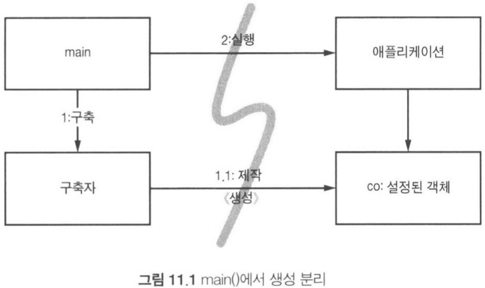
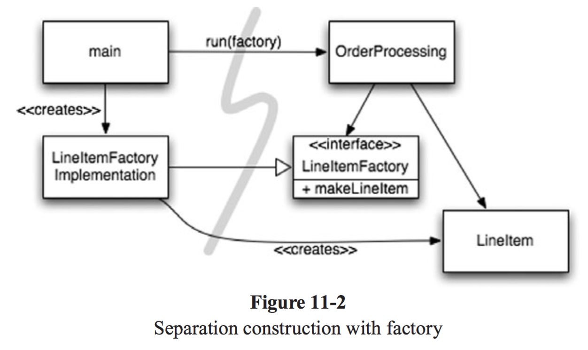

# 9. 단위 테스트

### TDD 법칙 세 가지

TDD가 실제 코드를 짜기 전에 단위 테스트부터 짜라

1. 실패하는 단위 테스트를 작성할 때까지 실제 코드를 작성하지 않는다.
2. 컴파일은 실패하지 않으면서 실행이 실패하는 정도로만 단위 테스트를 작성한다.
3. 현재 실패하는 테스트를 통과할 정도로만 실제 코드를 작성한다.


### 깨끗한 테스트 코드 유지하기

실제 코드가 진화하면 테스트 코드도 변해야 한다. 테스트 코드가 복잡할수록 실제 코드를 짜는 시간보다 테스트 케이스를 추가하는 시간이 더 걸릴 수 있다.

깨끗한 단위 테스트 코드를 짜는 것이 중요함. 테스트 코드는 실제 코드 못지 않게 중요하다.

#### 테스트는 유연성, 유지보수성, 재사용성을 제공한다

코드에 유연성, 유지보수성, 재사용성을 제공하는 버팀목이 `단위 테스트`. 테스트 케이스가 있으면 변경이 쉬워진다.

실제 코드를 점검하는 자동화된 단위 테스트 슈트는 설계와 아키텍처를 최대한 깨끗하게 보존하는 열쇠


### 깨끗한 테스트 코드

깨끗한 테스트 코드를 만들려면 `가독성`. 테스트 코드에서 가독성을 높이려면 명료성, 단순성, 풍부한 표현력이 필요. 최소의 표현으로 많은 것을 나타내야 함

`BUILD-OPERATE-CHECK 패턴`이 테스트 구조에 적합. 첫 부분은 테스트 자료를 만들고, 두 번째 부분은 테스트 자료를 조작하며, 세 번째 부분은 조작한 결과가 올바른지 확인

**테스트 코드는 진짜 필요한 자료 유형과 함수만 사용**

#### 도메인에 특화된 테스트 언어

시스템 조작 API를 사용하는 대신 API 위에다 함수와 유틸리티를 구현한 후 그 함수와 유틸리티를 사용하는게 테스트 코드를 짜기도 읽기도 쉬워진다.

이렇게 구현한 함수와 유틸리티는 테스트를 구현하는 당사자와 나중에 테스트를 읽어볼 독자를 도와주는 테스트 언어. 

#### 이중 표준

테스트 코드는 실제 코드만큼 간결하고, 표현력이 풍부해야 하지만, 실제 코드만큼 효율적인 필요는 없다.

실제 환경에서는 안되지만 테스트 환경에서는 전혀 문제없는 방식이 있음. 대개 메모리나 CPU 효율과 관련 있는 경우. 테스트 환경은 자원이 제한적일 가능성이 낮다.


### 테스트 당 assert 하나

JUnit으로 테스트 코드를 짤 때는 함수마다 assert 문을 단 하나만 사용하라는 말이 있는데 이 방법은 결론이 하나라 코드를 이해하기 쉽고 빠름

assert 문을 하나만 쓰기 위해 테스트를 분리하면 중복되는 코드가 많아진다. 이는 TEMPLATE METHOD 패턴을 사용해 중복을 제거할 수 있지만 배보다 배꼽이 더 클 수 있다.

개념당 assert 문을 최소로 줄이는 방향이 좋다.

#### 테스트 당 개념 하나

테스트 함수마다 한 개념만 테스트하라. 

#### 안좋은 예

```js
const assert = require('assert');

describe('MakeMomentJSGreatAgain', () => {
  it('handles date boundaries', () => {
    let date;

    date = new MakeMomentJSGreatAgain('1/1/2015');
    date.addDays(30);
    assert.equal('1/31/2015', date);

    date = new MakeMomentJSGreatAgain('2/1/2016');
    date.addDays(28);
    assert.equal('02/29/2016', date);

    date = new MakeMomentJSGreatAgain('2/1/2015');
    date.addDays(28);
    assert.equal('03/01/2015', date);
  });
});
```

#### 좋은 예

```js
const assert = require('assert');

describe('MakeMomentJSGreatAgain', () => {
  it('handles 30-day months', () => {
    const date = new MakeMomentJSGreatAgain('1/1/2015');
    date.addDays(30);
    assert.equal('1/31/2015', date);
  });

  it('handles leap year', () => {
    const date = new MakeMomentJSGreatAgain('2/1/2016');
    date.addDays(28);
    assert.equal('02/29/2016', date);
  });

  it('handles non-leap year', () => {
    const date = new MakeMomentJSGreatAgain('2/1/2015');
    date.addDays(28);
    assert.equal('03/01/2015', date);
  });
});
```


### F.I.R.S.T

Fast 빠르게 : 테스트는 빨리 돌아야 한다.

Independent 독립적으로 : 각 테스트는 서로 의존하면 안된다. 각 테스트는 독립적으로 그리고 어떤 순서로 실행해도 괜찮아야 한다.

Repeatable 반복가능하게 : 테스트는 어떤 환경에서도 반복 가능해야 한다.테스트가 돌아가지 않는 환경이 하나라도 있다면 테스트가 실패한 이유를 둘러댈 변명이 생긴다.

Self-Validating 자가검증하는 : 테스트는 bool 값으로 결과를 내야 한다. 테스트가 스스로 성공과 실패를 가늠하지 않는다면 판단은 주관적이 된다.

Timely 적시에 : 테스트는 적시에 작성해야 한다. 단위 테스트는 테스트하려는 실제 코드를 구현하기 직전에 구현한다.


### 결론

깨끗한 테스트 코드는 실제 코드보다 더 중요할지도. 테스트 코드는 지속적으로 깨끗하게 관리하자. 표현력을 높이고 간결하게 정리하자. 

테스트 API를 구현해 도메인 특화 언어(Domain Specific Language:DSL)을 만들자.


# 10. 클래스

### 클래스 체계

표준 자바 관례에 따르면 가장 먼저 변수 목록, 그 다음으로 정적 비공개 변수, 비공개 인스턴스 변수. 

변수 목록 다음에는 공개 함수. 비공개 함수는 자신을 호출하는 공개 함수 직후에. 즉, 추상화 단계가 순차적으로 내려감. 그래서 프로그램은 신문 기사처럼 읽힘

#### 캡슐화

변수나 유틸리티 함수는 가능한 공개하지 않는 것이 낫지만 때로는 protected로 선언해 테스트 코드에 접근을 허용하기도 함

하지만 그 전에 비공개 상태를 유지할 방법 강구. 캡슐화를 풀어주는 결정은 언제나 최후의 수단


### 클래스는 작아야 한다!

클래스는 작아야 한다. 작명은 클래스 크기를 줄이는 관문. 한 개의 클래스에 너무 많은 책임을 주지 말 것

#### 단일 책임 원칙 (Single Responsibility Principle, SRP)

> 클래스는 책임, 즉 변경할 이유가 단 하나뿐이어야 한다는 원칙. 

책임, 즉 변경할 이유를 파악하려 애쓰다 보면 코드를 추상화하기도 쉬워짐

큰 클래스 몇개보다 작은 클래스 여럿으로 이뤄진 시스템이 더 바람직함


#### 응집도 (Cohesion)

클래스는 인스턴스 변수 수가 작아야 함. 각 클래스 메서드는 클래스 인스턴스 변수를 하나 이상 사용해야 함. 

일반적으로 메서드가 변수를 더 많이 사용할수록 메서드와 클래스는 응집도가 더 높음. 

응집도가 높다는 말은 클래스에 속한 메서드와 변수가 서로 의존하며 논리적인 단위로 묶인다는 의미. 응집도가 높아지도록 변수와 메서드를 적절히 분리해 새로운 클래스로 쪼개줘야 함

#### 응집도를 유지하면 작은 클래스 여럿이 나온다

클래스가 응집력을 잃는다면 쪼개라. 프로그램에 점점 더 체계가 잡히고 구조가 투명해진다


### 변경하기 쉬운 클래스

깨끗한 시스템은 클래스를 체계적으로 정리해 변경에 수반하는 위험을 낮춘다.

클래스 일부에서만 사용되는 비공개 메서드는 코드를 개선할 잠재적인 여지를 시사함. 하지만 실제로 개선에 뛰어드는 계기는 시스템이 변해서라야 함

새 기능을 수정하거나 기존 기능을 변경할 때 건드릴 코드가 최소인 시스템 구조가 바람직함

#### 변경으로부터 격리

상세한 구현에 의존하는 클라이언트 클래스는 구현이 바뀌면 위험에 빠지기 때문에, 인터페이스와 추상 클래스를 사용해 구현에 미치는 영향을 격리

상세한 구현에 의존하는 코드는 테스트가 어려움

테스트가 가능할 정도로 시스템의 **결합도를 낮추면** 유연성과 재사용성도 더욱 높아짐

결합도를 최소로 줄이면 자연스럽게 DIP(Dependency Inversion Principle)를 따르는 클래스가 나옴. DIP는 클래스가 상세한 구현이 아니라 추상화에 의존해야 한다는 원칙


## 자바스크립트에서의 적용

### ES5의 함수보다 ES2015/ES6의 클래스를 사용해라

상속이 필요한 경우라면 클래스를 사용하는 것이 좋다. 하지만 크고 복잡한 객체가 필요한 경우가 아니라면 클래스보다 작은 함수를 사용해라

##### 안좋은예

```js
const Animal = function(age) {
  if (!(this instanceof Animal)) {
    throw new Error("Instantiate Animal with `new`");
  }
    
  this.age = age;
};

Animal.prototype.move = function() {};

const Mammal = function(age, furColor) {
  if (!(this instanceof Mammal)) {
    throw new Error("Instantiate Mammal with `new`");
  }

  Animal.call(this, age);
  this.furColor = furColor;
};

Mammal.prototype = Object.create(Animal.prototype);
Mammal.prototype.constructor = Mammal;
Mammal.prototype.liveBirth = function liveBirth() {};

const Human = function(age, furColor, languageSpoken) {
  if (!(this instanceof Human)) {
    throw new Error("Instantiate Human with `new`");
  }

  Mammal.call(this, age, furColor);
  this.languageSpoken = languageSpoken;
};

Human.prototype = Object.create(Mammal.prototype);
Human.prototype.constructor = Human;
Human.prototype.speak = function speak() {};
```

##### 좋은 예

```js
class Animal {
  constructor(age) {
    this.age = age;
  }

  move() { /* ... */ }
}

class Mammal extends Animal {
  constructor(age, furColor) {
    super(age);
    this.furColor = furColor;
  }

  liveBirth() { /* ... */ }
}

class Human extends Mammal {
  constructor(age, furColor, languageSpoken) {
    super(age, furColor);
    this.languageSpoken = languageSpoken;
  }

  speak() { /* ... */ }
}
```


### 메소드 체이닝을 사용해라

메소드 체이닝은 코드를 간결하고 이해하기 쉽게 만들어준다. 클래스 함수에서 단순히 모든 함수의 끝에 `this`를 리턴해주는 것으로 클래스 메소드를 추가로 연결할 수 있다.

##### 안좋은 예

```js
class Car {
  constructor() {
    this.make = 'Honda';
    this.model = 'Accord';
    this.color = 'white';
  }

  setMake(make) {
    this.make = make;
  }

  setModel(model) {
    this.model = model;
  }

  setColor(color) {
    this.color = color;
  }

  save() {
    console.log(this.make, this.model, this.color);
  }
}

const car = new Car();
car.setColor('pink');
car.setMake('Ford');
car.setModel('F-150');
car.save();
```

##### 좋은예

```js
class Car {
  constructor() {
    this.make = 'Honda';
    this.model = 'Accord';
    this.color = 'white';
  }

  setMake(make) {
    this.make = make;
    // 메모: 체이닝을 위해 this를 리턴합니다.
    return this;
  }

  setModel(model) {
    this.model = model;
    // 메모: 체이닝을 위해 this를 리턴합니다.
    return this;
  }

  setColor(color) {
    this.color = color;
    // 메모: 체이닝을 위해 this를 리턴합니다.
    return this;
  }

  save() {
    console.log(this.make, this.model, this.color);
    // 메모: 체이닝을 위해 this를 리턴합니다.
    return this;
  }
}

const car = new Car()
  .setColor('pink')
  .setMake('Ford')
  .setModel('F-150')
  .save();
```


### 상속보단 조합(composition)을 사용

가능하다면 상속보다는 조합을 사용. 상속을 사용해서 코드를 작성하고자 할 때, 만약 조합을 이용하면 더 코드를 잘 짤 수 있지 않을까 생각해볼 것

조합보다 상속을 쓰는게 더 좋을만한 예시

1. 상속관계가 "has-a" 관계가 아니라 "is-a" 관계일 때 (사람->동물 vs. 유저->유저정보)
2. 기반 클래스의 코드를 다시 사용할 수 있을 때 (인간은 모든 동물처럼 움직일 수 있다.)
3. 기반 클래스를 수정하여 파생된 클래스 모두를 수정하고 싶을 때 (이동시 모든 동물이 소비하는 칼로리를 변경하고 싶을 때)

##### 안좋은예

```js
class Employee {
  constructor(name, email) {
    this.name = name;
    this.email = email;
  }

  // ...
}

// 이 코드가 안좋은 이유는 Employees가 tax data를 "가지고" 있기 때문입니다.
// EmployeeTaxData는 Employee 타입이 아닙니다.
class EmployeeTaxData extends Employee {
  constructor(ssn, salary) {
    super();
    this.ssn = ssn;
    this.salary = salary;
  }

  // ...
}
```

##### 좋은예

```js
class EmployeeTaxData {
  constructor(ssn, salary) {
    this.ssn = ssn;
    this.salary = salary;
  }
  
  // ...
}

class Employee {
  constructor(name, email) {
    this.name = name;
    this.email = email;
  }

  setTaxData(ssn, salary) {
    this.taxData = new EmployeeTaxData(ssn, salary);
  }
  // ...
}
```


### 단일 책임 원칙 (Single Responsibility Principle, SRP)

클래스를 수정 할 때는 수정 해야하는 이유가 2개 이상 있으면 안된다. 하나의 클래스에 너무 많은 기능들이 있으면 이 작은 기능들을 수정할 때 이 코드가 다른 모듈들에 어떠한 영향을 끼치는지 이해하기 어려울 수 있음

##### 안좋은예

```js
class UserSettings {
  constructor(user) {
    this.user = user;
  }

  changeSettings(settings) {
    if (this.verifyCredentials()) {
      // ...
    }
  }

  verifyCredentials() {
    // ...
  }
}
```

##### 좋은예

```js
class UserAuth {
  constructor(user) {
    this.user = user;
  }

  verifyCredentials() {
    // ...
  }
}


class UserSettings {
  constructor(user) {
    this.user = user;
    this.auth = new UserAuth(user);
  }

  changeSettings(settings) {
    if (this.auth.verifyCredentials()) {
      // ...
    }
  }
}
```


# 11. 시스템

> 복잡성은 죽음이다

### 도시를 세운다면?

도시는 잘 돌아간다. 각 분야를 관리하는 팀이 있기 때문. 적절한 추상화와 모듈화 덕분

소프트웨어 팀도 도시처럼 구성한다. 깨끗한 코드를 구현하면 낮은 추상화 수준에서 관심사를 분리하기 쉬워진다.

이 장에서는 높은 추상화 수준, 즉 시스템 수준에서도 깨끗함을 유지하는 방법을 살펴본다.


### 시스템 제작과 시스템 사용을 분리하라

제작(construction)은 사용(use)와 다르다.

소프트웨어 시스템은 애플리케이션 객체를 제작하고 의존성을 서로 연결하는 `준비과정`과 준비 과정 이후에 이어지는 `런타임 로직`을 분리해야 한다

관심사 분리는 가장 오래되고 가장 중요한 설계 기법 중 하나. 대다수 애플리케이션은 시작 단계라는 관심사를 분리하지 않는다.

```java
public Service getService(){
  if(service === null)
    service = new MyServiceImpl(...); // 모든 상황에 적합한 기본값인지?
 	retun service;
}
```

초기화 지연(Lazy Initialization) 혹은 계산 지연(Lazy Evalution)이라는 기법. 

이 방식은 실제로 필요할 때까지 객체를 생성하지 않으므로 불필요한 부하가 걸리지 않고, 어떤 경우에서 null 포인터를 반환하지 않는다. 

하지만 getService 메서드가 MyServiceImpl과 생성자 인수에 명시적으로 의존

MyServiceImpl이 무거운 객체라면 단위 테스트에서 getService 메서드를 호출하기 전에 적절한 테스트 전용 객체를 service 필드에 할당해야 함

일반 런타임 로직에다 객체 생성 로직을 섞어놓았기 때문에 모든 실행 경로도 테스트 해야함. 이는 단일 책임 원칙을 깨는 것

무엇보다 MyServiceImpl이 모든 상황에 적합한 객체인지 모름

초기화 지연 기법을 수시로 사용하면 모듈성은 저조하고 중복이 심각해질 수 있음

설정 논리는 일반 실행 논리와 분리해야 모듈성이 높아짐

#### Main 분리

시스템 생성과 시스템 사용을 분리하는 한 가지 방법으로, 생성과 관련한 코드는 모두 main이나 main이 호출하는 모듈로 옮기고, 나머지 시스템은 모든 객체가 생성되었고 모든 의존성이 연결되었다고 가정

main 함수에서 시스템에 필요한 객체를 생성한 후 애플리케이션에 넘기면 애플리케이션은 그저 객체를 이용할뿐



모든 의존성 화살표는 main 쪽에서 애플리케이션 쪽을 향하는데, 즉 애플리케이션은 main이나 객체가 생성되는 과정을 전혀 모른다는 뜻

#### 팩토리

`ABSTRACT FACTORY 패턴` 객체가 생성되는 시점을 애플리케이션이 결정



#### 의존성 주입

> 하나의 객체가 다른 객체의 의존성을 제공하는 테크닉. "의존성"은 예를 들어 서비스로 사용할 수 있는 객체이다. 클라이언트가 어떤 서비스를 사용할 것인지 지정하는 대신, 클라이언트에게 무슨 서비스를 사용할 것인지를 말해주는 것이다. "주입"은 의존성(서비스)을 사용하려는 객체(클라이언트)로 전달하는 것을 의미

사용과 제작을 분리하는 강력한 메커니즘 하나가 의존성 주입(Dependency Injection). 의존성 주입은 제어 역전 기법을 의존성 관리에 적용한 메커니즘

제어 역전에서는 한 객체가 맡은 보조 책임을 새로운 객체에게 전적으로 떠넘기고, 새로운 객체는 넘겨받은 책임만 맡으므로 단일 책임 원칙을 지키게 됨

의존성 관리 맥락에서 객체는 의존성 자체를 인스턴스로 만드는 책임은 지지 않고, 대신에 이런 책임을 다른 전담 메커니즘에 넘겨야만 한다.

클래스는 의존성을 해결하려 시도하지 않고, 의존성을 주입하는 방법으로 설정자(setter) 메서드나 생성자 인수를 제공. DI 컨테이너는 필요한 객체의 인스턴스를 만든 후 생성자 인수나 설정자 메서드를 사용해 의존성을 설정. 실제로 생성되는 객체 유형은 설정 파일에서 지정하거나 특수 생성 모듈에서 코드로 명시

대다수 DI 컨테이너는 필요할 때까지는 객체를 생성하지 않고, 대부분 계산 지연이나 비슷한 최적화에 쓸 수 있도록 팩토리를 호출하거나 프록시를 생성하는 방법 제공. 즉, 계산 지연 기법이나 이와 유사한 최적화 기법에서 이런 메커니즘을 사용할 수 있음


### 확장

처음부터 올바르게 시스템을 만들 수는 없다. 오늘 주어진 사용자 스토리에 맞춰 시스템을 구현하고, 내일은 새로운 스토리에 맞춰 시스템을 조정하고 확장하면 된다.

이것이 반복적이고 점진적인 애자일 방식의 핵심. 테스트 주도 개발(TDD), 리팩터링, 깨끗한 코드는 코드 수준에서 시스템을 조정하고 확장하기 쉽게 만든다.

시스템 수준에서는 관심사를 적절히 분리해 관리한다면 소프트웨어 아키텍처가 점진적으로 발전할 수 있다.

#### 횡단(corss-cutting) 관심사

원론적으로는 모듈화되고 캡슐화된 방식으로 영속성 방식을 구상할 수 있지만 현실적으로는 영속성 방식을 구현한 코드가 온갖 객체로 흩어짐 (횡단 관심사)

영속성 프레임워크 또한 모듈화할 수 있고, 도메인 논리도 모듈화할 수 있지만, 문제는 두 영역이 세밀한 단위로 겹친다

`관점 지향 프로그래밍(Aspect-Oriented Programming, AOP)`는 횡단 관심사에 대처해 모듈성을 확보하는 일반적인 방법론

AOP에서 관점(aspect)이라는 모듈 구성 개념은 **특정 관심사**를 지원하려면 시스템에서 **특정 지점들이 동작하는 방식을 일관성 있게 바꿔야 한다**고 명시


### 테스트 주도 시스템 아키텍처 구축

관점으로 관심사를 분리하는 방식은 그 위력이 막강. 코드 수준에서 아키텍처 관심사를 분리할 수 있다면, 진정한 테스트 주도 아키텍처 구축이 가능해짐

그때그때 새로운 기술을 채택해 단순한 아키텍처를 복잡한 아키텍처로 키워갈 수도 있음

아주 단순하면서도 멋지게 분리된 아케틱처로 소프트웨어 프로젝트를 진행해 결과물을 빨리 출시하고, 기반 구조를 추가하며 조금씩 확장해나가도 괜찮음


### 의사 결정을 최적화하라

모듈을 나누고 관심사를 분리하면 지엽적인 관리와 결정이 가능해짐.  최대한 정보를 모아 마지막 순간에 최선을 결정을 내리는 것이 좋음


### 명백한 가치가 있을 때 표준을 현명하게 사용하라

### 시스템은 도메인 특화 언어가 필요하다

DSL(Domain-Specific Language)는 간단한 스크립트 언어나 표준 언어로 구현한 API. DSL로 짠 코드는 도메인 전문가가 작성한 산문처럼 읽힘

좋은 DSL은 도메인 개념과 그 개념을 구현한 코드 사이에 존재하는 의사소통 간극을 줄여줌. 

효과적으로 사용하면 DSL은 추상화 수준을 코드 관용구나 디자인 패턴 이상으로 끌어올린다.


### 결론

시스템 역시 깨끗해야 한다.

모든 추상화 단계에서 의도는 명확히 표현해야 한다.

시스템을 설계하든 개별 모듈을 설계하든, 실제로 돌아가는 가장 단순한 수단을 사용해야 한다


# 12. 창발성

> 창발성 : **하위계층(구성 요소)에는 없는 특성이나 행동이 상위계층(전체 구조)에서 자발적으로 돌연히 출현하는 현상**

### 창발적 설계로 깔끔한 코드를 구현하자

켄트 벡이 제시한 단순한 설계 규칙 네 가지

1. 모든 테스트를 실행한다.
2. 중복을 없앤다
3. 프로그래머 의도를 표현한다
4. 클래스와 메서드 수를 최소로 줄인다


### 단순한 설계 규칙 1: 모든 테스트를 실행하라

테스트를 철저히 거쳐 모든 테스트 케이스를 항상 통과하는 시스템은 '테스트가 가능한 시스템'. 검증이 불가능한 시스템은 출시하면 안된다

테스트가 가능한 시스템을 만들려고 애쓰면 품질이 더불어 높아진다. 크기가 작고 목적 하나만 수행하는 클래스가 나온다.

SRP를 준수하는 클래스는 테스트가 훨씬 더 쉽다.

결합도가 높으면 테스트 케이스를 작성하기 어렵다. 개발자는 DIP와 같은 원칙을 적용하고, 의존성 주입, 인터페이스, 추상화 등과 같은 도구를 사용해 결합도를 낮춘다.

테스트 케이스를 만들고 계속 돌리라는 간단한 규칙을 따르면 시스템은 낮은 결합도와 높은 응집력이라는 객체 지향 방법론이 지향하는 목표를 저절로 달성

즉, 테스트 케이스를 작성하면 설계 품질이 높아진다.


### 단순한 설계 규칙 2~4 : 리팩터링

테스트 케이스를 모두 작성했으면, 코드를 점진적으로 리팩터링 해나간다. 테스트 케이스가 있기 때문에 코드를 정리하면서 시스템이 깨질까 걱정할 필요가 없음

리팩터링 단계에서는 소프트웨어 설계 품질을 높이는 기법이라면 무엇이든 적용해도 괜찮다.


### 중복을 없애라

소규모 재사용은 시스템 복잡도를 극적으로 줄여준다.

`TEMPLATE METHOD 패턴`은 고차원 중복을 제거할 목적으로 자주 사용하는 기법

> 템플릿 메소드 패턴이란 특정 작업을 처리하는 일부분을 서브 클래스로 캡슐화하여 전체적인 구조는 바꾸지 않으면서 특정 단계에서 수행하는 내용을 바꾸는 패턴


### 표현하라

코드는 개발자의 의도를 분명히 표현해야 한다. 개발자가 코드를 명백하게 짤수록 다른 사람이 그 코드를 이해하기 쉬워진다. 그래야 결함이 줄어들고 유지보수 비용이 적게 든다.

1. 좋은 이름을 선택한다
2. 함수와 클래스 크기를 가능한 줄인다
3. 표준 명칭을 사용한다
4. 단위 테스트 케이스를 꼼꼼히 작성한다


### 클래스와 메서드 수를 최소로 줄여라

함수와 클래스 수를 가능한 줄여라. 목표는 함수와 클래스 크기를 작게 유지하면서 동시에 시스템 크기도 작게 유지하는데 있다.


### 결론

단순한 설계 규칙을 따른다면 오랜 경험 후에야 익힐 우수한 기법과 원칙을 단번에 활용할 수 있다.


# 13. 동시성

> 객체는 처리의 추상화다. 스레드는 일정의 추상화다.

동시성과 깔끔한 코드는 양립하기 어렵다. 여러 스레드를 동시에 돌리는 이유와 여러 스레드를 동시에 돌리는 어려움을 이해해보자


### 동시성이 필요한 이유?

동시성은 결합(coupling)을 없애는 전략. 즉 무엇(what)과 언제(when)를 분리하는 전략.

스레드가 하나인 프로그램은 무엇과 언제가 서로 밀접해서 호출 스택을 살펴보면 프로그램 상태가 곧바로 드러난다.

단일 스레드 프로그램을 디버깅하는 프로그래머는 일련의 정지점(breakpoint)를 정한 후 어느 정지점에 걸렸는지 살펴보면서 시스템 상태를 파악한다.

무엇과 언제를 분리하면 애플리케이션 구조와 효율이 극적으로 나아진다. 구조적인 관점에서 프로그램은 거대한 루프 하나가 아니라 작은 협력 프로그램 여럿으로 보인다.

구조적 개선만을 위해 동시성을 채택하는 것은 아니다. 어떤 시스템은 응답 시간과 작업 처리량 개선이라는 요구사항으로 동시성 구현이 불가피하다.

#### 미신과 오해

동시성이 반드시 필요한 상황이 존재한다. 동시성은 어렵기 때문에 각별히 주의하지 않으면 난감한 상황에 처한다.

##### 동시성과 관련한 일반적 미신과 오해

* 동시성은 항상 성능을 높여준다 => 때로 성능을 높여준다. 대기 시간이 길어 여러 스레드가 프로세서를 공유할 수 있거나, 여러 프로세서가 동시에 처리할 독립적인 계산이 많은 경우
* 동시성을 구현해도 설계는 변하지 않는다 => 단일 스레드 시스템과 다중 스레드 시스템은 설계가 판이하게 다름
* 웹 또는 EJB 컨테이너를 사용하면 동시성을 이해할 필요가 없다 => 실제로는 컨테이너가 어떻게 동작하는지, 어떻게 동시 수정, 데드락 등과 같은 문제를 피할 수 있는지 알아야 함

##### 동시성과 관련된 타당한 생각 몇 가지

* 동시성은 다소 부하를 유발한다. 성능 측면에서 부하가 걸리며, 코드도 더 짜야 한다.
* 동시성은 복잡하다.
* 일반적으로 동시성 버그는 재현하기 어렵다.
* 동시성을 구현하려면 흔히 근본적인 설계 전략을 재고해야 한다.


### 난관

동시성을 구현하기 어려운 이유는?

```java
public class X {
  private int lastIdUsed;
  
  public int getNextId(){
    return ++ lastIdUsed;
  }
}
```

인스턴스 X를 생성하고, lastIdUsed 필드를 42로 설정한 다음, 두 스레드가 해당 인스턴스를 공유할 때 두 스레드에서 getNextId(); 를 호출한다고 가정하면?

한 스레드는 43을 받고, 다른 스레드도 43을 받고, lastIdUsed 는 43이 됨

두 스레드가 자바 코드 한 줄을 거쳐가는 경로는 수없이 많은데 그 중에서 일부 경로가 잘못된 결과를 내놓기 때문. 대다수 경로는 올바른 결과를 내놓지만 문제는 잘못된 결과를 내놓는 일부 경로


### 동시성 방어 원칙

#### 단일 책임 원칙(Single Responsibility Principle, SRP)

SRP는 주어진 메서드/클래스/컴포넌트를 변경할 이유가 하나여야 한다는 원칙. **동시성 관련 코드는 다른 코드와 분리해야 한다.**

동시성을 구현할 때는 몇 가지를 고려한다.

* 동시성 코드는 독자적인 개발, 변경, 조율 주기가 있다.
* 동시성 코드는 독자적인 난관이 있다. 다른 코드에서 겪는 난관과 다르며 훨씬 어렵다.
* 잘못 구현한 동시성 코드는 별의별 방식으로 실패한다.

#### 따름 정리(corollary) : 자료 범위를 제한하라

공유 객체를 사용하는 코드 내 임계영역을 `synchronized 키워드`로 보호하는 것 권장. 자료를 캡슐화하고 공유 자료를 최대한 줄여라

> 임계 구역(critical section) 또는 공유변수 영역은 **병렬컴퓨팅에서 둘 이상의 스레드가 동시에 접근해서는 안되는 공유 자원(자료 구조 또는 장치)을 접근하는 코드의 일부**

#### 따름 정리 : 자료 사본을 사용하라

공유 자료를 줄이려면 처음부터 공유하지 않는 방법이 제일 좋음. 어떤 경우에는 객체를 복사해 읽기 전용으로 사용하는 방법이 가능함

#### 따름 정리 : 스레드는 가능한 독립적으로 구현하라

각 스레드가 다른 스레드와 자료를 공유하지 않고 클라이언트 요청 하나를 처리하며, 모든 정보는 비공유 출처에서 가져오며 로컬 변수에 저장하면 다른 스레드와 동기화할 필요가 없다

독자적인 스레드로, 가능하면 다른 프로세서에서 돌려도 괜찮도록 자료를 독립적인 단위로 분할하라


### 동기화하는 메서드 사이에 존재하는 의존성을 이해하라

공유 객체 하나에는 메서드 하나만 사용해라. 


### 동기화하는 부분을 작게 만들어라

여기저기서 syncrhronized 문을 남발하는 코드는 바람직하지 않지만 임계영역은 반드시 보호해야 한다. 따라서 코드를 짤 때 임계영역 수를 최대한 줄여야 한다.

동기화하는 부분을 최대한 작게 만들어라


### 결론

다중 스레드 코드는 올바로 구현하기 어렵기 때문에 각별히 깨끗하게 코드를 짜야 한다.


## 자바스크립트에서의 적용

### Callback 대신 Promise를 사용해라

##### 안좋은예

```Js
require('request').get('https://en.wikipedia.org/wiki/Robert_Cecil_Martin', (requestErr, response) => {
  if (requestErr) {
    console.error(requestErr);
  } else {
    require('fs').writeFile('article.html', response.body, (writeErr) => {
      if (writeErr) {
        console.error(writeErr);
      } else {
        console.log('File written');
      }
    });
  }
});
```

##### 좋은예

```js
require('request-promise').get('https://en.wikipedia.org/wiki/Robert_Cecil_Martin')
  .then((response) => {
    return require('fs-promise').writeFile('article.html', response);
  })
  .then(() => {
    console.log('File written');
  })
  .catch((err) => {
    console.error(err);
  });
```


### Async/Await은 Promise보다 더욱 깔끔함

`Promise`도 `Callback`에 비해 정말 깔끔하지만 ES2017/ES8에선 `async`와 `await`이 있고, 이는 더욱 깔끔한 해결책을 준다. 

ES2017/ES8을 사용할 수 있다면 Async/Await을 사용해라

##### 안좋은예

```js
require('request-promise').get('https://en.wikipedia.org/wiki/Robert_Cecil_Martin')
  .then(response => {
    return require('fs-promise').writeFile('article.html', response);
  })
  .then(() => {
    console.log('File written');
  })
  .catch(err => {
    console.error(err);
  })
```

##### 좋은예

```js
async function getCleanCodeArticle() {
  try {
    const response = await require('request-promise').get('https://en.wikipedia.org/wiki/Robert_Cecil_Martin');
    await require('fs-promise').writeFile('article.html', response);
    console.log('File written');
  } catch(err) {
    console.error(err);
  }
}
```
